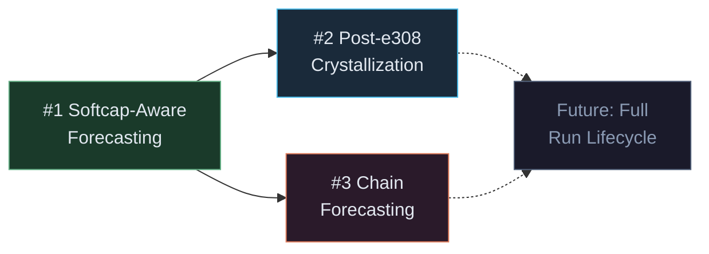

# Dusted: Next Steps — Impact & Effort Analysis

Each proposed feature is evaluated against three dimensions:
- **Impact** — How much does this improve recommendation accuracy and user decision-making?
- **Effort** — What code changes and data requirements are involved?
- **Risk** — What can go wrong, and what unknowns might block us?

---

## Overview Matrix

| Feature | Impact | Effort | Risk | Priority |
|---|---|---|---|---|
| **Softcap-Aware Forecasting** | 🟡 Medium | 🟢 Low | 🟢 Low | **#1 — Do First** |
| **Post-e308 Crystallization Logic** | 🔴 High | 🔴 High | 🟡 Medium | **#2 — Core Feature** |
| **Multi-Step Chain Forecasting** | 🟡 Medium | 🟡 Medium | 🟡 Medium | **#3 — Polish** |

---

## Feature #1: Softcap-Aware Forecasting

### Why First?
This is the cheapest fix that eliminates an active source of **wrong recommendations**. Right now, if you're at 29,000 active ticks and the softcap is 30,780, the engine might recommend waiting 2,000 ticks for DC7. But 1,780 of those ticks are inside the softcap's `0.5` power zone — the engine doesn't know that. It's lying to you about the payoff. Fixing this is a prerequisite for the other features to produce trustworthy numbers.

### Impact: 🟡 Medium
- Eliminates false positives where the engine recommends long waits that cross the softcap boundary.
- Makes the `Time Saved` column accurate in the endgame, where it matters most.
- However, this situation only arises when you're close to the softcap. For most of the run, the current logic is already correct.

### Effort: 🟢 Low (~30 lines changed in `content.js`)
All data needed is already available. No new parsing, no new UI elements.

### Implementation Plan

**Step 1: Create a softcap-aware `t_wait` calculation function**

The current `t_wait` formula is naive:
```js
const diff = Decimal.max(0, cost.sub(effectiveDust));
const t_wait = diff.div(P_tick).toNumber();
```

This assumes `P_tick` stays constant during the wait. But `P_tick` grows at `1.02x/tick` while active, and growth drops to `1.02^0.5` per tick after softcap. We need a function that correctly accumulates dust across the boundary:

```
function estimateWaitTicks(dustNeeded, P_tick, activeTicks, softcap) {
  // Phase 1: ticks remaining before softcap
  const ticksToSoftcap = Math.max(0, softcap - activeTicks);
  
  // Phase 2: simulate accumulation
  // Before softcap: dust grows geometrically at rate 1.02
  // After softcap:  dust grows geometrically at rate 1.02^0.5 ≈ 1.00995
  
  // Use geometric series: sum = P * (r^n - 1) / (r - 1)
  // Solve for n given the sum threshold
}
```

**Step 2: Gate the DC/TC evaluation through this function**

Replace the simple `diff.div(P_tick)` calls in `evaluateStrategy()` (lines 210-211 and 243-244) with the new softcap-aware function.

**Step 3: Adjust post-purchase `P_new` estimation**

When calculating `t_floor_after` (the time to reach e308 after buying), the current code uses:
```js
const t_floor_after = (308 - P_new_estimated.log10()) / Math.log10(1.02);
```
This also needs to account for whether the remaining ticks will be pre- or post-softcap. If the purchase happens after the softcap has been hit, the floor calculation should use `Math.log10(1.02) * 0.5` as the growth rate.

### Risk: 🟢 Low
- All values (`activeTicks`, `softcap`) are already parsed and available.
- The math is well-defined: geometric series with a known rate change at a known boundary.
- No new game data needed, no scraping changes required.

### Open Question
> Does the `0.5` power modifier apply to the *compounding exponent* (`1.02^(tick * 0.5)`) or as a flat multiplier to P_tick (`P_tick * 0.5`)? 
> The Stats page says `power 0.500` — this strongly suggests the exponent, meaning growth rate drops from `1.02` to `1.02^0.5 ≈ 1.00995`. We should verify this empirically by observing `Dust/Tick` growth before and after the softcap boundary.

---

## Feature #2: Dynamic Post-e308 Crystallization Logic

### Why Second?
This is the **highest-impact** feature for endgame players. Once you pass `e308`, the current engine goes silent ("Pushing to Target"). The player is left guessing whether to keep grinding for the next mote or cut their losses and crystallize. This decision is the single most consequential choice in each run — crystallizing too late wastes thousands of ticks, crystallizing too early leaves motes on the table.

### Impact: 🔴 High
- Transforms the engine from a "floor optimizer" into a full **run lifecycle advisor**.
- Directly saves the player real-time by preventing wasted softcap ticks.
- The recommendation becomes the most valuable *after* e308, which is precisely when the current engine goes dark.

### Effort: 🔴 High

This is the hardest feature because it requires **data we don't currently have** and **math that spans multiple runs**.

### What We Need — Data Requirements

| Data Point | Currently Available? | How to Get It |
|---|---|---|
| Current Dust | ✅ Yes | `span.yel` or text parse |
| Dust/Tick | ✅ Yes | `span.oran` or text parse |
| Pending Motes | ✅ Yes | CR tab parse |
| Current Motes | ✅ Yes | Text parse |
| Active Ticks | ✅ Yes | Text parse |
| Softcap | ✅ Yes | Stats tab parse |
| **Dust threshold for next Mote** | ❌ **No** | Needs reverse-engineering or CR tab scraping |
| **Fresh-run P_tick baseline** | ❌ **No** | Needs to be estimated from mote count + TC count post-crystallize |
| **Historical run duration** | ❌ **No** | Could be tracked internally by the extension |

### Implementation Plan

**Phase A: Mote Threshold Discovery (Research)**

The CR tab shows `motes gained ~X`. We need to understand the relationship between Dust and Mote gain. Two approaches:

1. **Empirical observation:** Track dust levels as motes increment. Log `(dust, motes_gained)` pairs across multiple runs to derive the formula.
2. **Source analysis:** If the game's contract or frontend JS is readable, extract the Mote calculation formula directly.

> [!IMPORTANT]
> This is the **critical blocker**. Without knowing the Dust cost of the next Mote, we cannot calculate "time to next mote."

**Phase B: Fresh-Run Baseline Estimation**

After crystallizing, your new run starts with more motes, which means a stronger TC stack. We need to estimate the *starting P_tick* of a hypothetical fresh run. This requires:

1. Knowing the new mote count after crystallization: `currentMotes + pendingMotes`
2. Knowing TC count (survives crystallization): `compressions`
3. Estimating the resulting base `P_tick` from these values

The TC formula tells us:
```
M_tc = (1.0583 * newMotePower) ^ (compressions * efficiency)
```
But the *starting* `P_tick` of a fresh run also depends on condenser carry effects and other factors we may not fully understand yet. This needs empirical calibration.

**Phase C: The Decision Algorithm**

Once we have the data, the decision is a comparison:

```
Option A: Keep grinding this run
  time_to_next_mote = ticks needed to reach next Mote dust threshold

Option B: Crystallize now, start fresh
  time_fresh_to_e308 = ticks for a fresh run to reach e308 floor (with new mote power)
  time_fresh_to_same_mote = time_fresh_to_e308 + ticks to reach this same mote threshold again

If time_to_next_mote > time_fresh_to_same_mote:
  → Recommend "CRYSTALLIZE EARLY"
Else:
  → Recommend "PUSH FOR NEXT MOTE (X ticks remaining)"
```

**Phase D: UI Changes**

- Replace `"Pushing to Target"` with a dynamic recommendation showing the comparison.
- Show a "Mote Progress" indicator: how far you are toward the next mote.
- Potentially show `"CRYSTALLIZE EARLY — saves ~Xm"` with a real time delta.

### Risk: 🟡 Medium
- **Primary risk:** The Mote formula is unknown. If it's complex or has hidden variables (like condenser-dependent scaling), the forecast will be inaccurate.
- **Mitigation:** Start with empirical logging. Add a "Mote Tracker" that silently records `(dust, pending_motes)` pairs over time to build up the formula.
- **Secondary risk:** The fresh-run baseline estimate may be wrong because we don't fully model all carry effects. But even a rough estimate (±20%) is far better than no recommendation at all.

---

## Feature #3: Multi-Step Chain Forecasting

### Why Third?
This is a **polish** feature. The current single-step evaluator already gives good recommendations most of the time. Chain forecasting only matters in edge cases where buying a cheap upgrade now would meaningfully accelerate affording an expensive one. In practice, the 1.02x compounding already grows your bank so fast that intermediate purchases rarely change the optimal path. But it would eliminate the occasional suboptimal recommendation.

### Impact: 🟡 Medium
- Fixes edge cases where the engine says "wait 300 ticks for DC6" but buying DC3 right now would reduce that wait to 200 ticks.
- More intellectually satisfying — the engine would feel smarter.
- But the actual time savings over the current approach is usually small (sub-minute in real time).

### Effort: 🟡 Medium (~80 lines, moderate complexity)

### Implementation Plan

**Step 1: Build a `SimulationState` object**

Create a lightweight snapshot of the game state that can be mutated without affecting `SHREDDER_STATE`:

```js
function createSimState() {
  return {
    P_tick: SHREDDER_STATE.dustPerTick,
    effectiveDust: SHREDDER_STATE.dust.add(SHREDDER_STATE.unclaimedDust),
    activeTicks: SHREDDER_STATE.activeTicks,
    softcap: SHREDDER_STATE.softcap,
    ticksElapsed: 0
  };
}
```

**Step 2: Greedy forward simulation**

```
function simulateBestSequence(simState, availableUpgrades, maxDepth = 3) {
  // At each step:
  // 1. Find all upgrades affordable NOW (t_wait === 0)
  // 2. For each affordable upgrade, simulate buying it:
  //    - Deduct cost from effectiveDust
  //    - Apply multiplier to P_tick
  //    - Recurse
  // 3. Also simulate "skip all, just wait for the best single target"
  // 4. Return the sequence with the lowest total time-to-floor
}
```

**Step 3: Cap recursion depth**

With 8 DCs + TC = 9 possible purchases, and a max depth of 3, the search space is at most `9^3 = 729` paths. Each path evaluation is just arithmetic (no DOM access), so this runs in <1ms. No performance concern.

**Step 4: Update recommendation format**

If the best path is a chain, display it as:
```
BUY DC3 → THEN DC5
```
This requires a small UI update to the recommendation renderer in `sidepanel.js`.

### Risk: 🟡 Medium
- **Greedy ≠ Optimal:** A greedy depth-3 search might miss a depth-4 optimal path. But given the exponential growth mechanics, deeper chains are almost never worth it — the compounding makes later purchases trivially cheap.
- **Complexity risk:** The recommendation display gets more complex. Need to handle "Buy X now, then Y in Z ticks" gracefully without cluttering the UI.
- **Validation risk:** Harder to verify correctness than single-step evaluation. Should add a debug/logging mode to dump the simulation tree.

---

## Recommended Execution Order



1. **Do #1 first** — it's low effort, eliminates active bugs, and its `softcap-aware t_wait` function becomes a building block for #2 and #3.
2. **Do #2 next** — highest impact, but requires research into the Mote formula. Start with the data-gathering phase (empirical logging) while working on #1.
3. **Do #3 last** — it's a pure quality-of-life improvement. The single-step evaluator is already "good enough" for most gameplay moments.

---

## Immediate Action Items

Before any coding on #2, we need to answer these unknowns:

1. **Mote Formula:** Visit the CR tab at different dust levels and record `(dust, pending_motes)` pairs. Is it `floor(log10(dust) / X)`? Is it linear past e308?
2. **Power Modifier Behavior:** Verify whether `power 0.500` means `1.02^(tick*0.5)` or `P_tick * (1.02^tick) * 0.5`. Observe Dust/Tick before and after softcap.
3. **Carry Effects:** What exactly carries over on crystallization besides motes and TC count? Do condenser *counts* carry? Do upgrade tiers carry?
4. **Fresh Run Baseline:** What is `P_tick` at tick 0 of a fresh run with N motes and M compressions? Log this on the next crystallization.
